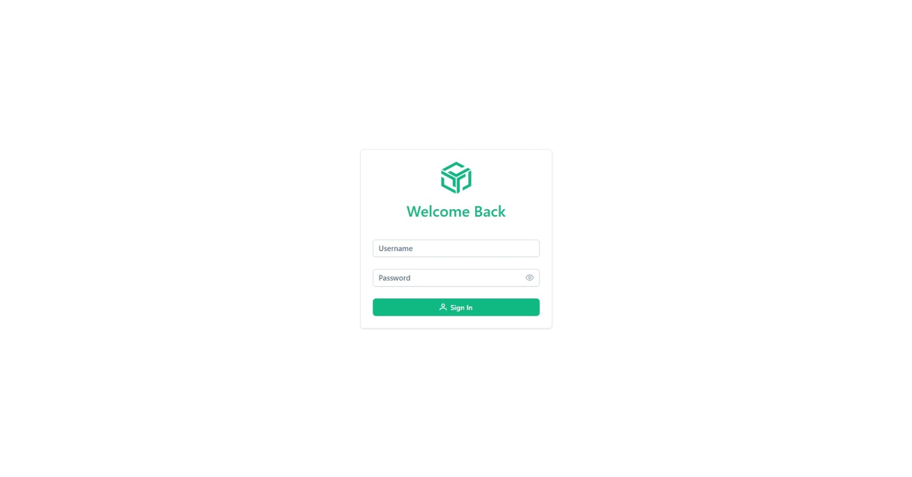
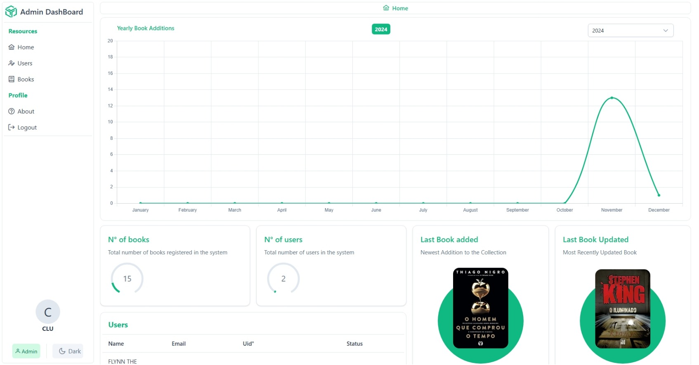
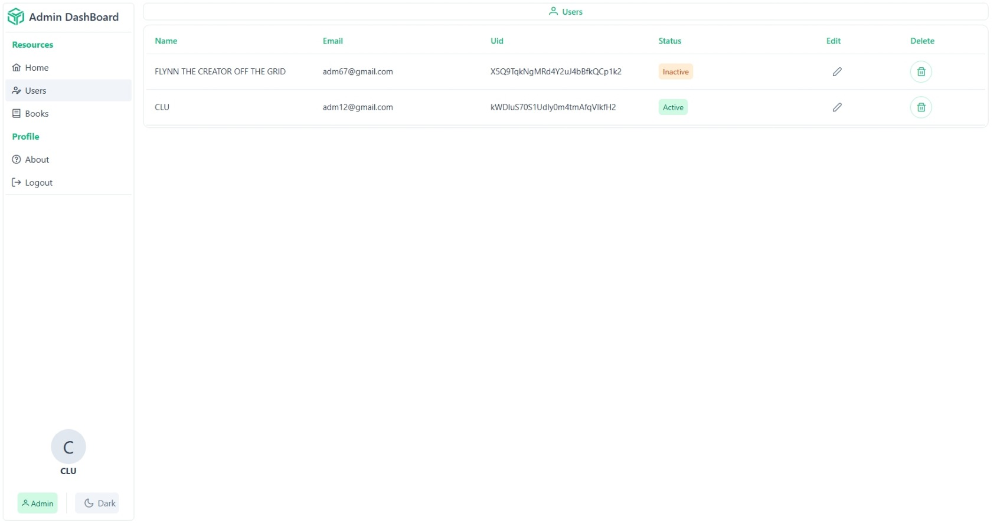
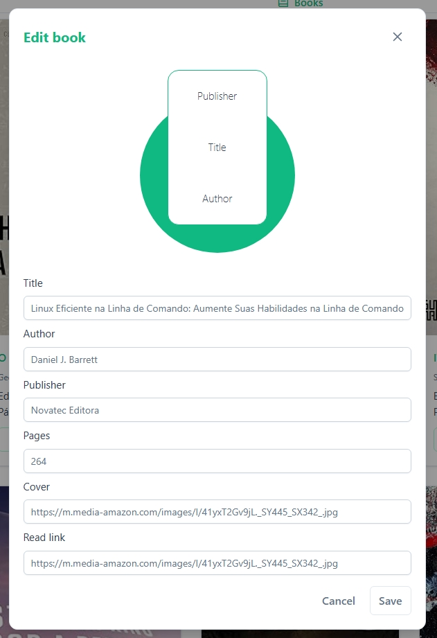
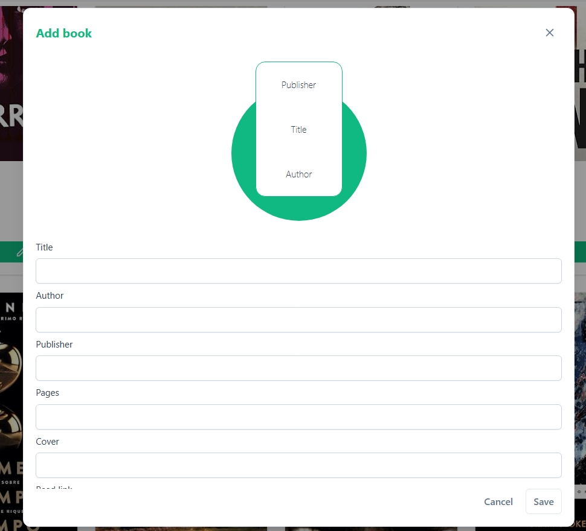
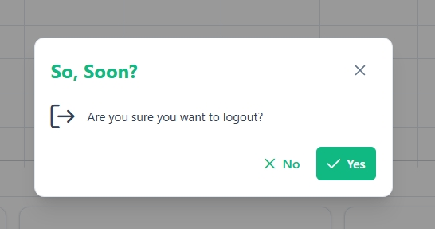

# 📚 Books Manager – Vue, Node & Firebase


---

### 📖 Project to manage books and users for a library

This project aims to provide an easy and visual system to manage books and users in a library. It supports login, registration, editing, and deletion of records with real-time Firebase integration.

---

## 📸 Screenshots

<p align="center">
  
  
  <br><br>
  
  
</p>

---

### 🪟 System Modals

<p align="center">
  
  
  
</p>

---

## ⚙️ How to run the project

### 🧩 Front-end

```bash
cd client
cd dashboard-administracao
npm install
npm run build
```

Check if the __dist__ folder was created inside dashboard-administracao.

### 🖥️ Back-end
```bash
cd server
npm run start:dev
```
---

### 🔐 Firebase environment variables

Create a Firebase account and add these variables to the back-end .env file:

```dotenv
FIREBASE_PROJECT_ID = "[YOUR_PROJECT_ID]"
FIREBASE_CLIENT_EMAIL = "[YOUR_CLIENT_EMAIL]"
FIREBASE_PRIVATE_KEY = "[YOUR_PRIVATE_KEY]"
FIREBASE_DATABASE_URL = "[YOUR_DATABASE_URL]"
```
---
## 📦 Dependencies

<div style="display: flex; gap: 3rem; flex-wrap: wrap;">
  <div style="flex: 1; min-width: 300px;">
    <h2 style="font-size: 18px; color: #10b981; border-bottom: 2px solid #10b981; padding-bottom: 6px; margin-bottom: 12px;">
      🖼️ Front-end
    </h2>
    <table style="width: 100%; border-collapse: collapse; font-size: 14px;">
      <thead style="background-color: #d1fae5; color: #065f46;">
        <tr>
          <th style="padding: 10px; border: 1px solid #ccc; text-align: left;">Package</th>
          <th style="padding: 10px; border: 1px solid #ccc; text-align: left;">Version</th>
        </tr>
      </thead>
      <tbody>
        <tr><td style="padding: 8px; border: 1px solid #ccc;">autoprefixer</td><td style="padding: 8px; border: 1px solid #ccc;">10.4.20</td></tr>
        <tr><td style="padding: 8px; border: 1px solid #ccc;">chart.js</td><td style="padding: 8px; border: 1px solid #ccc;">4.4.8</td></tr>
        <tr><td style="padding: 8px; border: 1px solid #ccc;">cypress</td><td style="padding: 8px; border: 1px solid #ccc;">13.17.0</td></tr>
        <tr><td style="padding: 8px; border: 1px solid #ccc;">eslint</td><td style="padding: 8px; border: 1px solid #ccc;">8.57.1</td></tr>
        <tr><td style="padding: 8px; border: 1px solid #ccc;">firebase</td><td style="padding: 8px; border: 1px solid #ccc;">11.4.0</td></tr>
        <tr><td style="padding: 8px; border: 1px solid #ccc;">pinia</td><td style="padding: 8px; border: 1px solid #ccc;">2.3.1</td></tr>
        <tr><td style="padding: 8px; border: 1px solid #ccc;">postcss</td><td style="padding: 8px; border: 1px solid #ccc;">8.5.3</td></tr>
        <tr><td style="padding: 8px; border: 1px solid #ccc;">primeicons</td><td style="padding: 8px; border: 1px solid #ccc;">7.0.0</td></tr>
        <tr><td style="padding: 8px; border: 1px solid #ccc;">primevue</td><td style="padding: 8px; border: 1px solid #ccc;">4.3.1</td></tr>
        <tr><td style="padding: 8px; border: 1px solid #ccc;">tailwindcss-primeui</td><td style="padding: 8px; border: 1px solid #ccc;">0.3.4</td></tr>
        <tr><td style="padding: 8px; border: 1px solid #ccc;">tailwindcss</td><td style="padding: 8px; border: 1px solid #ccc;">3.4.17</td></tr>
        <tr><td style="padding: 8px; border: 1px solid #ccc;">typescript</td><td style="padding: 8px; border: 1px solid #ccc;">5.4.5</td></tr>
        <tr><td style="padding: 8px; border: 1px solid #ccc;">vite</td><td style="padding: 8px; border: 1px solid #ccc;">5.4.14</td></tr>
        <tr><td style="padding: 8px; border: 1px solid #ccc;">vitest</td><td style="padding: 8px; border: 1px solid #ccc;">1.6.1</td></tr>
        <tr><td style="padding: 8px; border: 1px solid #ccc;">vue-router</td><td style="padding: 8px; border: 1px solid #ccc;">4.5.0</td></tr>
        <tr><td style="padding: 8px; border: 1px solid #ccc;">vue-tsc</td><td style="padding: 8px; border: 1px solid #ccc;">2.2.4</td></tr>
        <tr><td style="padding: 8px; border: 1px solid #ccc;">vue</td><td style="padding: 8px; border: 1px solid #ccc;">3.5.13</td></tr>
      </tbody>
    </table>
  </div>

  <div style="flex: 1; min-width: 300px;">
    <h2 style="font-size: 18px; color: #10b981; border-bottom: 2px solid #10b981; padding-bottom: 6px; margin-bottom: 12px;">
      🧩 Back-end
    </h2>
    <table style="width: 100%; border-collapse: collapse; font-size: 14px;">
      <thead style="background-color: #d1fae5; color: #065f46;">
        <tr>
          <th style="padding: 10px; border: 1px solid #ccc; text-align: left;">Package</th>
          <th style="padding: 10px; border: 1px solid #ccc; text-align: left;">Version</th>
        </tr>
      </thead>
      <tbody>
        <tr><td style="padding: 8px; border: 1px solid #ccc;">@types/express-session</td><td style="padding: 8px; border: 1px solid #ccc;">1.18.1</td></tr>
        <tr><td style="padding: 8px; border: 1px solid #ccc;">api</td><td style="padding: 8px; border: 1px solid #ccc;">0.0.1</td></tr>
        <tr><td style="padding: 8px; border: 1px solid #ccc;">cypress</td><td style="padding: 8px; border: 1px solid #ccc;">14.3.3</td></tr>
        <tr><td style="padding: 8px; border: 1px solid #ccc;">dotenv</td><td style="padding: 8px; border: 1px solid #ccc;">16.4.7</td></tr>
        <tr><td style="padding: 8px; border: 1px solid #ccc;">express-session</td><td style="padding: 8px; border: 1px solid #ccc;">1.18.1</td></tr>
        <tr><td style="padding: 8px; border: 1px solid #ccc;">express</td><td style="padding: 8px; border: 1px solid #ccc;">5.0.1</td></tr>
        <tr><td style="padding: 8px; border: 1px solid #ccc;">firebase-admin</td><td style="padding: 8px; border: 1px solid #ccc;">12.7.0</td></tr>
        <tr><td style="padding: 8px; border: 1px solid #ccc;">firebase</td><td style="padding: 8px; border: 1px solid #ccc;">10.14.1</td></tr>
        <tr><td style="padding: 8px; border: 1px solid #ccc;">globals</td><td style="padding: 8px; border: 1px solid #ccc;">15.15.0</td></tr>
        <td style="padding: 8px; border: 1px solid #ccc;">tsup</td><td style="padding: 8px; border: 1px solid #ccc;">8.4.0</td></tr>
        <td style="padding: 8px; border: 1px solid #ccc;">tsx</td><td style="padding: 8px; border: 1px solid #ccc;">4.19.3</td></tr>
        <td style="padding: 8px; border: 1px solid #ccc;">typescript-eslint</td><td style="padding: 8px; border: 1px solid #ccc;">8.24.1</td></tr>
        <td style="padding: 8px; border: 1px solid #ccc;">typescript</td><td style="padding: 8px; border: 1px solid #ccc;">5.7.3</td></tr>
      </tbody>
    </table>
  </div>
</div>
